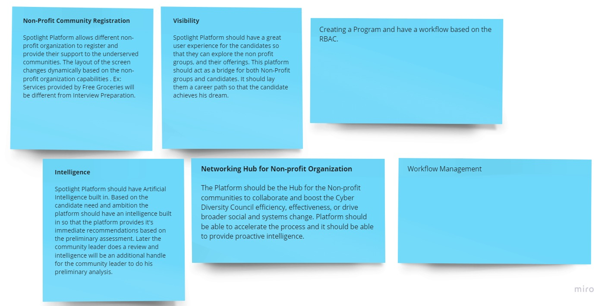

# Diversity Cyber Council Kata

by [Goal Diggers]

## Table of Contents

```text

Diversity Cyber Council description

Architecture KATA: Program Requirements

Spotlight Platform Vision

Team Members

Assumptions

Goals: Phase 1, Phase 2, Phase 3

Miroboard Work : Link (Give the description what does the MIRO board contains)
	
	Actors and Stakeholders
	Definitions
	Domains
	Core Domains
	Generic Domains
	Supporting Domains
	High-Level Process Discovery

Functional Requirements: It should capture all the functional requirements and elaborate Process Discovery into detailed steps.

Architecture (Capture Implicit and Explicit Architecture charectaristics 

	High Level Context Diagram	
	High Level Component Diagram	
	DDD Contextmap based on the process discovery
		
		Processes have to be broken into 2 parts. One is Registration and tracking the Metrics, Roadmap milestones post Registration.
				
		Candidate Registration, Assesment, Mentor Assignment, Roadmap Planning, NPO Allocation to the Candidate
		NPO Registration, Assesment, Roadmap Planning, NPO Allocation to the Candidate
		Candidate Performance Metrics
		NPO Performance Metrics
		NPO Capacity Planner
		NPO Allocation Engine		
		
		NPO Networking HUB		
		
		Training Portal Integration
		
		Administration
		  Creating NPO and Candidate Assessments
		  Creating Primary Data for the Registration Process
		  Creating Rules for Decision Engine
		  			
	Microservices Event Driven Architecture for all the above process flows
		Behaviour -> Sequence diagram
		Related ADRs
		
	Hexagon Architecture
	
	Deployment View
	
	ADRs
	
	Risks, Security

## 1. Overview

Introduction:

Diversity Cyber Council is a 501c3 Non-Profit that serves under-represented demographics in the tech industry by facilitating education, training, and staffing opportunities to establish a sustainable and diverse talent pipeline to the workforce. Odie Gray is the founder and president of the Diversity Cyber Council with extensive experience on cyber security, business strategy development and transformation for last 15 years. As a thought leader he has delivered strategic value to his clients by developing new cyber security service offerings to his clients by developing new cybersecurity offerings and programs and managing teams of industry leading organizations.

Current Platform:

* It is offering 3 courses and it helps the underserved communities to register to these courses with a standard form. After the aspirant gets registered he gets notified on mail. 
* In addition the platform also allows the non-profit organizations to register and help in facilitating the education, training and staffing of underrepresented groups in cybersecurity. For now they can donate, or partner to provide apprentice program on cyber security or become an employer partner or a strategic partner.

Team contact: [goaldiggerskata@hotmail.com](mailto:goaldiggerskata@hotmail.com)

Contributors:
* [MVS Rama Krishna](https://www.linkedin.com/in/mvs-ramakrishna-a3a57225/)
* [B Suman]
* [Rama Surendra Babu G](https://www.linkedin.com/in/rama-surendra-babu-g-985a1913/)


Process Discovery:


