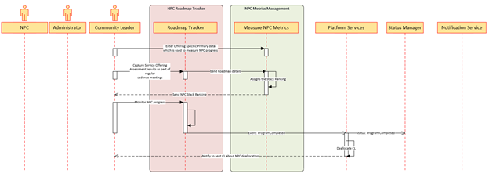

< [Home](../README.md) | [Previous](./9_Arch_NonProfitCommunityRegistration.md) | [Next](./11_Arch_NonProfitCommunityNetworkingHUB.md) >

#  NPC Roadmap Tracker
This is a critical process in the platform. 

- **The primary actor for this process will be Community Leader, NPC and Administrator.** 
- All the critical milestones of the NPC which were aligned during the initial meetings with Community Leader will be updated by the NPC based on the regular assessments done. 
- NPC Roadmap Tracker captures all the regular meeting and provides all the data to the NPC Metrics management.
- NPC Metrics Management plays a critical role and the Decision Engine will validates and assigns the NPC Stack ranking.

## Prerequisites:
- NA

## Output:

- Completion of Program Offering services per candidate.
- Helps in NPC Capacity Planning 
- Administrator will be able to assess the bandwidth of the NPC.

## Subdomain and Bounded Context:

Below are the Core, Generic and Supporting Subdomains which get involved for the NPC registration process.

- **Core Subdomain:** NA
- **Supporting Subdomain:** NPC Roadmap Tracker, NPC Metrics Management, Decision Engine
- **Generic Subdomains:** Platform Services, Status Manager, Notification Services

## Non-Profit Community Roadmap Tracker Sequence Flow:

  

## Key Patterns and ADRs identified for the  NPC Roadmap Tracker process:

- [Graph DB](../ADRs/ADR007_GraphDB.md)
- [BFF](../ADRs/ADR012_BFF.md)
- [CQRS](../ADRs/ADR013_CQRS.md)

< [Home](../README.md) | [Previous](./9_Arch_NonProfitCommunityRegistration.md) | [Next](./11_Arch_NonProfitCommunityNetworkingHUB.md) >
