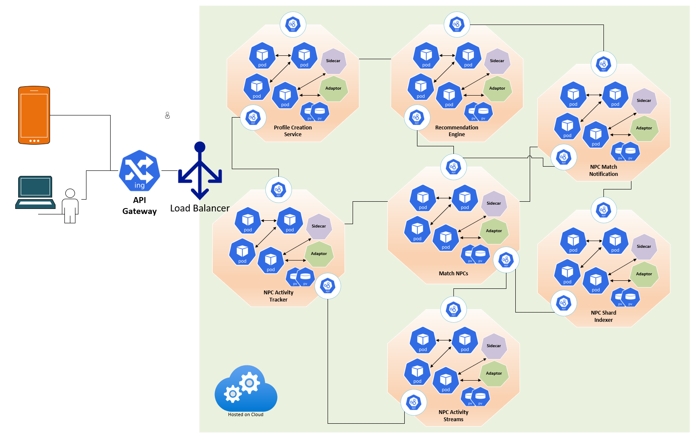
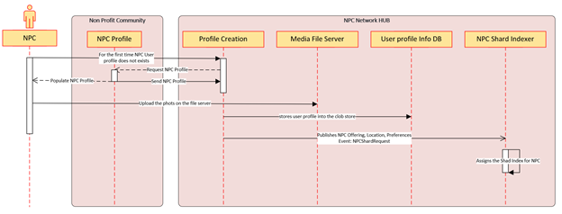

< [Home](../README.md) | [Previous](./10_Arch_NPCRoadmapTracker.md) | [Next](./12_Arch_NPCActivityTrackeronNPCNetworkHUB.md) >

#  Non Profit Community Networking HUB

The section covers all the functionalities and system architecture for the Network HUB. From the strategy perspective as Networking HUB is a core subdomain our approach towards architecture is different. 

Below is the process discovery which was done as part of the event storming sessions.

Non Profit Community Networking HUB Process Discovery

  

## High Level In Scope
- The process gets kicked off once the NPC Roadmap tracker sub domain sends an event to initiate the Profile creation.
- NPC user will be allowed to add additional data and upload photos.
- NPC should be able to perform different activities like posting, tagging etc., 
- NPC should get notifications when matched with other NPC
- NPC should be able to view recommendations of other NPC in geographically nearby regions.
- NPC can move to different location and still the NPC Networking HUB should be able to get the recommendations of nearby NPCs
- All the onboarded NPCs of the Spotlight platform will be the users of the Networking HUB. 
- Networking HUB will feed stream data which will help the Candidate NPC allocation
- Post Non Profit Services, Events, Create Channels etc.,
- Push Notifications to NPCs based on Matching, Likes, Interest, Post etc.,

## Next Phase Scope
- Chatting Service on the HUB.
- Onboarded Candidate will have a Read only View to gain knowledge of the NP Community activities happening based on the Geo-Location.
- Candidate can show up interest to participate and contribute in NP Community services but this needs Mentor approval.
- Support for multiple languages if the Spotlight platform expands the services globally.

## Subdomain and Bounded Context:

Below are the Core, Generic and Supporting Subdomains which get involved for the NPC registration process.
- **Core Subdomain:** Networking HUB
- **Supporting Subdomain:** Profile Creation, NPC Activity Tracker, Recommendation Engine, NPC Match Notification, NPC Shard Indexer, Match NPCs, NPC Activity Streams
- **Generic Subdomains:** Platform Services, Status Manager, Notification Services

## Non Profit Community Networking HUB Context view and Bounded Context

  

- There will be a stack of microservices behind the API gateway, which serve the Non Profit Community user requests. 
- As soon the NPC user logins to the Network site for the first time, it invokes NPC Profile API hosted by the “Non Profit Community Core subdomain” will be invoked to add to the corresponding sharded index so that the NPC shows up the recommendations of the nearby NPC members of the Spotlight platform. 
- Based on the NPC User profile, Hub Recommendation engine will pull out the matching NPC information and displays to the user. The HUB Recommendation Engine liverages the indexes created to come up with the list of matching recommendations to the NPC. 
- Once the NPC user starts Liking through those recommendations, the HUB Like Service receives those Likes and places them in a data-streams. 
- This service should be elastic enough to handle the inflow and it pushes the data into Kafka Streams. 
- There will be a pool of activity based on HUB Worker services which read data from these streams for generating NPC matches. 
- The HUB Worker queries on the Likes data and sends the match notification to both the NPC users using Web Sockets.

**Note: For depiction we have considered “Like” as one such activity which a NPC perform on the HUB.**

## NPC Profile Creation: For the first time user. 

- NPC doesn’t need to register in the Network HUB
- When the NPC logs into the Hub for the first time the NPC Profile creation service checks for the existence of the profile. If the profile doesn't exist it will invoke the API to pull the information available in the NPC Core domain
- Once the data is retrieved and the same gets persisted to the corresponding Sharded Index 
 
## Login:
- OAuth or Single sign on will be used to validate the NPC profile. The profile service will be hosted by the Non Profit Community domain.
- Once the validation is complete NPC will be able to see other NPC profiles based on the NPC Network Recommendation Engine. This engine is part of NPC HUB Core domain. 
- NPC Activity Tracker: NPC Network HUB will act as matching engine so that the most NPCs meet. This is to establish meaningful relationships to provide service offerings to the candidates. The core objective is to track the activity of the NPC on the HUB.
- Pull Data: When a NPC does oAuth using FB, LinkedIn etc., it collects lots of meaningful information like location, distance, likes, dislikes. It also extracts lots of information from pictures from the Post to understand community activities, events, CSR etc., and these get appended to the NPC profile.
- NPC Ranker: It is a critical background component which assigns a random scores and based on these NPC will be grouped. It is achieved using shard/distribute, as we can’t keep all the data in one Graph DB. 
- NPC Service Offering Levelling technique: If one NPC is getting too much of matches/attention, to make it fair for NPCs, Networking normalizes this by not showing to other NPC but at the same time if any NPC is not showing attention the Recommendation Engine will start showing up to other NPC about it’s services.
- Reply/Tagging: How willingly the NPC is replying and getting tagged to other NPCs
- User can upload photos. There is a limit, it’s governed by the Spotlight platform Administrator. All the photos/videos are persisted in a Blob store and the path in the Graph DB.
- Neo4J is used as Graph DB.
- Service makes a request to fetch the recommendations from the HUB Recommendation Engine. This is a preliminary set and cached index.
- At the same time a domain event “Recommendations” is fired asynchronously to the engine for a refined recommendation.

## NPC Profile Creation on the NPC Network HUB

  

## NPC Activity Tracker:
- This service captures all the sequence of operations that gets executed by a user 
   - Post like
   - Tag
   - Posts
   - Accepts Notifications
   - Creating Channels
   - Voting Request for Community Service
    
- Each activity mentioned above will have Unique Microservices per Activity. Examples below
- TAG: NPC Tag Activity Service
- Posts: NPC POST Activity Service
- Each activity above has separate stream. As the new feature gets added to the activities section, we will have to introduce new streams.
- Each activity can be used for data analysis for different use cases.
- All these streams are ultimately read by the Unique Activity Tracker Service. For every Activity we will have separate microservices. This gives flexibility to plan, scale, analyze, cache the data based on the user activity on the network hub.
- For Instance NPC A, does only Likes the Posts. For this user more Posts and NPC offerings will be recommended.
- Another NPC B, does lot of Posts about their service offerings. For this user more Notifications and Tag requests are sent.
- All these activities are posted to the Sharded Graph DB.

< [Home](../README.md) | [Previous](./10_Arch_NPCRoadmapTracker.md) | [Next](./12_Arch_NPCActivityTrackeronNPCNetworkHUB.md) >
