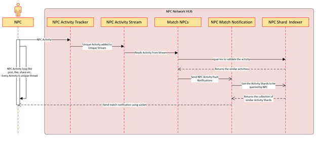

[<-- Back to Home](../README.md)
[<-  NonProfit Community Networking HUB](./11_Arch_NonProfitCommunityNetworkingHUB.md)
[->  NPC Recommendation Engine](./13_Arch_NPCRecommendationEngine.md)

#### NPC Activity Tracker on NPC Network HUB
 

#### NPC Collaboration Request: 
This is a unique activity which helps the NPCs to collaborate.
- NPC A sends collaboration Request to NPC B.
- Collaboration request is posted into the unique collaboration stream and same gets notified to NPC B
- If NPC B accepts the collaboration request both get tagged.

[<-- Back to Home](../README.md)
[<-  NonProfit Community Networking HUB](./11_Arch_NonProfitCommunityNetworkingHUB.md)
[->  NPC Recommendation Engine](./13_Arch_NPCRecommendationEngine.md)
