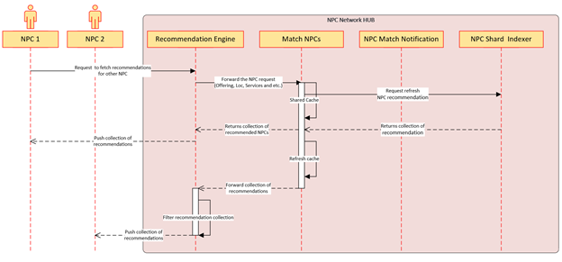

< [Home](../README.md) | [Previous](./12_Arch_NPCActivityTrackeronNPCNetworkHUB.md) | [Next](./14_Arch_FabricCausalClusterandNosinglepointoffailure.md) >

# HUB Recommendation Engine: 
It is core service which is executing as a backend process responsible for 
  - Send notifications, 
  - Identify Recommendations, 
  - Matching Requests,
  - Customize the user content on the page. 
- Every Activity which the user performs on the Network HUB is forwarded to the Shard Indexer Service.
- Shard Indexer service exposes an API.
- Once the API is invoked, it determines which shard to be queried based on the activity done by the user.
- Indexer queries all the sharded graphs to fetch the list based on the activity search and return the list to the Recommendation Engine. 
- Engine applies to filter on the list bases on the NPC Preferences and returns final list.
- Recommendation Engine also pulls data from NPC Roadmap Tracker subdomain.

## HUB Recommendation Engine

  

## Shard Indexer:  

- This component provides the data from the Shard Graph DB.
- Exposes two different set of services
- One pool of services which will keep helping the 
  - **NPC Match Notification Service:** For provide the match notifications
  - **Match NPCs:** For providing match recommendations.  
- The other pool is For reads, the Indexer service implements queries independently.
  - For each reading activity we will have a separate instance and whereas for the other write/update transactions will have a separate service. This implementation is primarily because the demands for the queries are predominantly different. 
- This domain holds **Shard DB Architecture** which is very critical to handle the traffic. The proposed architecture is to divide data into horizontal partitions that are organized into various servers. 
- Primary reasons to select the Shard DB Architecture are given below:
  - Data will be siloed into separate instances based on different NPC activities
    - By Region
    - Action  	
    - By Service Offerings
    - By Likes
    - Events
    - To minimize the latency

< [Home](../README.md) | [Previous](./12_Arch_NPCActivityTrackeronNPCNetworkHUB.md) | [Next](./14_Arch_FabricCausalClusterandNosinglepointoffailure.md) >
