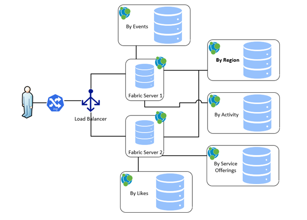

# Fabric Causal Cluster and No single point of failure
 

- Architecture proposed is separating the data stores into shards and placing them based on the activity into separate graph DBs. 
- This gives flexibility any combination of inhouse or cloud to fit the business needs and requirements. 
- The above architecture representation has 2 coordinated shards which will give us always high availability and We have separated the fabric database to solely handle all of the load and processing of requests.

## Data Division
- As part of the analysis the context and the data definitions will be clearly defined and how the data has to be modeled so that we can have subgraphs.
- All the shards will be divided based on activity or on location. 