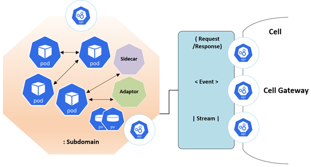

< [Home](../README.md) | [Previous](./1_Arch_Overview.md) | [Next](./6_Arch_CandidateRegistration.md) >

# Spotlight Context Diagram 
  

    
  

  
  ## The Architectural characteristics that are identified are as below:

- Scalability
- Modularity     
- Composability
- Governance 
- Extendibility 
- Agility 
- Testability  
- Deployability 
- Workflow
- Security

# Architecture Component Diagram
The Architecture proposal is to use **Microservices Oriented style** with multiple autonomous microservices each owning it’s data with in a **Subdomain and implementing different patterns within each microservice with simple CRUD, CQRS patterns using HTTP as a communication protocol between the client apps and the microservices**. 

  

**Note: Cell representation should be octagonal but for diagrammatic representation we have changed as below in out Component Diagram**.

  

#  Spotlight Platform Component Diagram 

  

**Cell is a representation of a Subdomain and divides the area of the business between the Candidate and Non-Profit Community**. 

Each cell has a bounded context and solves the problem statement with the help of it’s coarse grained microservices which are part of the cell. Each cell is expected to solve a specific **subdomain problem**.

- Each cell will be a collection of microservices and components which are grouped and identified as part of the process discovery and later designed, implemented and deployed. 
- Cell is an independently managed entity which can have its own observability, deployment, pipeline and version. This encapsulation ensures each subdomain to migrate, deploy without impacting users and other subdomains. 
- The components, microservices within the cell can communicate with each other using REST APIs. All the intra cell communication will be either synchronous or asynchronous.

  - **Asynchronous:** All these communication for data update propagation across the cell is based on Domain Events and proposal is to use Streaming platform Kafka.
  - **Synchronous:** All these communication with be Restful services using an API gateway.

  

  - **Request Response:** API types provide an abstraction over everything that can be queried or activated based on the subdomain process needs.
  - **Domain Events:** allow action in real-time based on changes that occur during the business process and allowing subdomain to react on the fact.
  - **Streams:** capture the ongoing evolving nature of the environment, allowing pattern matching and analysis. It is primarily used in Networking HUB Core subdomain    to capture the Non Profit community activities on the HUB.

- Every Cell will have a document to depict all its offerings to other subdomains.
- All the capabilities which are expected to give value to it’s **external subdomains** will be exposed as network accessible endpoints. These endpoints will have APIs hosted. 
- In addition, if the cell needs access to external dependencies, then these must also be exposed as network endpoints through a cell-gateway. These endpoints can expose APIs, events, or streams. Any interfaces that the microservices or serverless components offer that are not made available by the control point should be inaccessible from outside of the cell. 

- **Security is Implicit Architectural Characteristic**. 
     - As each cell is mapped to a subdomain with it’s boundary so it gives flexibility to have it’s own unique security requirements. 
     - Each cell will have it’s own security rules, policies and approaches.
     - Proposal is to use to Identity Provider as Security Management is a Generic Subdomain stationed outside the Subdomains. 

- For all the microservices and components we will be adopting **container model**.
- Each container image instance represents a single process. 
- Each container image works as a boundary for a process, it will have primitives that can be used to scale or batch the process. **When the process completes, the container lifecycle ends**.
- Containers will also represent long-running processes like web servers and also be short-lived processes like batch jobs, implemented using Kubernetes Cron jobs. 
- If the process fails, the container ends, and the orchestrator takes over. The orchestrator will have how many instances should be running and if one fails, the orchestrator will create another container instance to replace the failed process.

< [Home](../README.md) | [Previous](./1_Arch_Overview.md) | [Next](./6_Arch_CandidateRegistration.md) >
