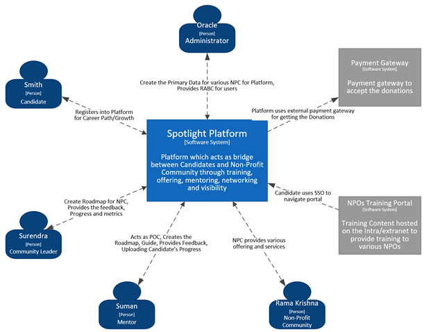

[<-- Back to Home](../README.md) ,
[<- Architecture Overview](./1_Arch_Overview.md) ,
[-> Architecture Component Diagram](./3_Arch_ArchitectureComponentDiagram.md)

# Spotlight Context Diagram 

## The Architectural characteristics that are identified are as below:

- Scalability
- Modularity     
- Composability
- Governance 
- Extendibility 
- Agility 
- Testability  
- Deployability 
- Workflow
- Security

[<-- Back to Home](../README.md) ,
[<- Architecture Overview](./1_Arch_Overview.md) ,
[-> Architecture Component Diagram](./3_Arch_ArchitectureComponentDiagram.md)
