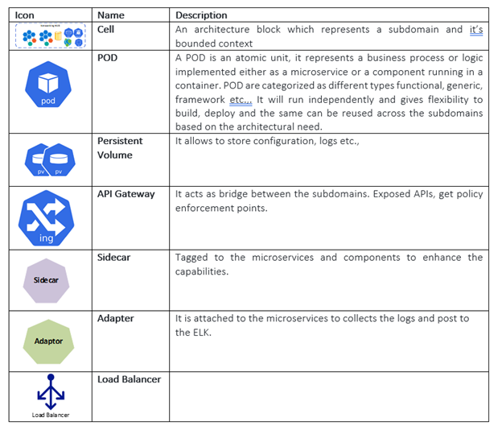

< [Home](../README.md) | [Previous](./2_Arch_SpotlightContextDiagram.md) | [Next](./4_Arch_SpotlightPlatformComponentDiagram.md) >

# Architecture Component Diagram
The Architecture proposal is to use **Microservices Oriented style** with multiple autonomous microservices each owning it’s data with in a **Subdomain and implementing different patterns within each microservice with simple CRUD, CQRS patterns using HTTP as a communication protocol between the client apps and the microservices**. 

  

**Note: Cell representation should be octagonal but for diagrammatic representation we have changed as below in out Component Diagram**.

  

< [Home](../README.md) | [Previous](./2_Arch_SpotlightContextDiagram.md) | [Next](./4_Arch_SpotlightPlatformComponentDiagram.md) >
