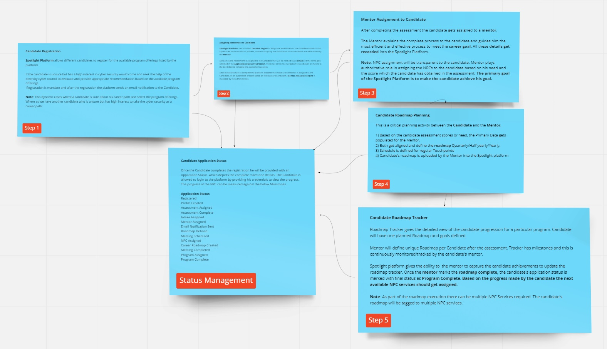

< [Home](../README.md) | [Previous](./5_Arch_DomainContextMaptoMicroservicesMapping.md) | [Next](./7_Arch_CandidateOnboardingProcess.md) >

# Candidate Registration

## Process Discovery:
**Candidate is the primary actor for the Spotlight Platform** to avail the program offerings provided by the Non Profit Communities. As part of the process discovery we have derived the below flow.

The below representation shows the high levels steps which the candidate has to undergo using the registration process. 

- **Every milestone of the Candidate Registration process has been captured in the Status Management tile provided by the Status Managment Subdomain**.
- The registration process is initiated by the candidate logging into the Spotlight platform (Mobile/Web).
- This is the initial step for the candidate, it starts with registration and ends with NPC assignment request.
- **Based on the Candidate’s Program offering preferences the user interface gets changed dynamically**.
- Candidate get notified with email to complete the profile after the mail id/mobile gets validated.
- Once the profile is created, administrator will approve and Candidate Intake ID is assigned.

  

## **Output**:

- Registration Complete and Intake Assigned.
 
## Subdomain and Bounded Context:

Below are the Core, Generic and Supporting Subdomains which get involved for the candidate registration process.

- **Core Subdomain:** Candidate Onboarding Community
- **Supporting Subdomain:** Candidate Roadmap Tracker 
- **Generic Subdomains:** Platform Services, Status Manager, Notification Services  

 **Candidate Registration Context view and bounded context**
 

  

**Candidate Registration Sequence Diagram**

  

  
Primary actors involved in the **Candidate Registration process are Candidate and Administrator**.

- It is a Single Page Application and can be extended to the mobile platform also. 
- React/Angular can be used to develop this.
- The above image depicts overall communication style used for the candidate registration. It shows all the subdomains, bounded context, microservices, events, API communication, notification services.

## ADRs:
Key Patterns and ADRs identified for the Candidate Registration process
- [BFF](../ADRs/ADR012_BFF.md)
- [CQRS](../ADRs/ADR013_CQRS.md)

< [Home](../README.md) | [Previous](./5_Arch_DomainContextMaptoMicroservicesMapping.md) | [Next](./7_Arch_CandidateOnboardingProcess.md) >
