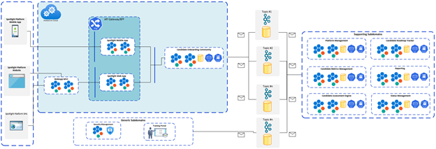

[<-- Back to Home](../README.md)
[<-  Candidate Registration](./6_Arch_CandidateRegistration.md)
[->  Candidate Roadmap Tracker](./8_Arch_CandidateRoadmapTracker.md)

###  Candidate Onboarding Process:

- **Candidate and Mentor both are primary actors for the candidate onboarding process.
- Candidate has an intake and waiting for the Mentor to onboard him/her onto the platform.
- As part of the registration the candidate has just raised the request for Non Profit Community offerings and got the Intake ID assigned.
- Once the candidate gets onboarded completely, mentor will assign him the NPC based on the assessment results.
- The below representation shows the high level steps which both the candidate and mentor have to undergo in order to complete the onboarding process. 
- **Every milestone of the Candidate Onboarding process has been captured in the Status Management tile.**

#### Prerequisite: Candidate Intake ID Assigned.

#### High level steps and Process discovery

- The onboarding process gets initiated once the candidate completes the registration process.
   
 

#### Output:
- Mentor Assigned.
- Non Profit Community Assigned and Program assigned.
- Candidate and Mentor initial Meeting is complete
- Roadmap Created

#### Subdomain and Bounded Context:

Below are the **Core, Generic and Supporting Subdomains*** which get involved for the candidate onboarding process.

- **Core Subdomain:** Candidate NPC Matching
- **Supporting Subdomain:** Candidate Roadmap Tracker
- **Generic Subdomains:** Platform Services, Status Manager, Notification Services

#### Candidate Registration Context view and bounded context 

 
 

#### Candidate Registration Sequence Diagram

 
 
#### Key Patterns and ADRs identified for the Candidate Registration process
- BFF
- CQRS

[<-- Back to Home](../README.md)
[<-  Candidate Registration](./6_Arch_CandidateRegistration.md)
[->  Candidate Roadmap Tracker](./8_Arch_CandidateRoadmapTracker.md)
