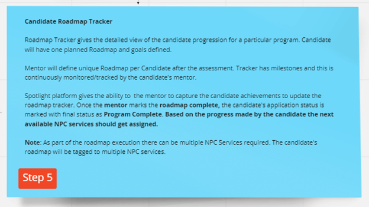
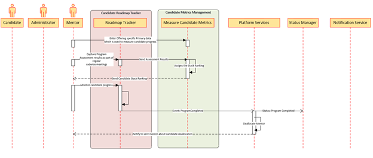

< [Home](../README.md) | [Previous](./7_Arch_CandidateOnboardingProcess.md) | [Next](./9_Arch_NonProfitCommunityRegistration.md) >

#  Candidate Roadmap Tracker
This is a critical component of the platform. 
**The primary actor for this process will be Candidate and the Mentor.** All the critical milestones of the candidate which were aligned during the initial meetings will be updated by the mentor based on the regular assessments/meetings.

## Process Discovery:

  

- **Candidate Roadmap Tracker** helps the mentor to capture the program assessment results.
- Candidate Roadmap Tracker capture all the regular meeting and provides all the data to the metrics management module.
- Based on the progress made by the candidate the next available **NPC services should get assigned.** if the candidate agrees.
- **Candidate Metrics Management** capture all the results and give the rating based on the benchmark defined by the Platform Management. Grading will be done based on the work submitted/assessed.

## Prerequisites:

- Candidate and NPC should have been onboarded.
- Candidate Mentor Assigned.
- Program Offering Assigned to the Candidate.

## Candidate Roadmap Tracking process:

  

## Output:
- TO DO

## Subdomain and Bounded Context: 

Below are the Core, Generic and Supporting Subdomains which get involved for the candidate onboarding process.

- **Core Subdomain:** NA
- **Supporting Subdomain:** Candidate Metrics Management, Candidate Roadmap Tracker
- **Generic Subdomains:** Platform Services, Status Manager, Notification Services

## Key Patterns and ADRs identified for the Candidate Roadmap Tracker process:

- [Graph DB](../ADRs/ADR007_GraphDB.md)
- [BFF](../ADRs/ADR012_BFF.md)
- [CQRS](./ADRs/ADR013_CQRS.md)

< [Home](../README.md) | [Previous](./7_Arch_CandidateOnboardingProcess.md) | [Next](./9_Arch_NonProfitCommunityRegistration.md) >
