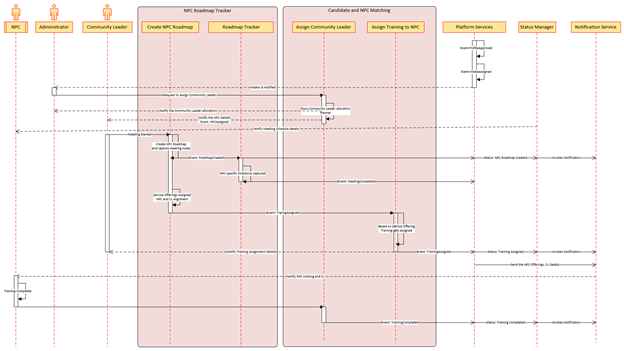

< [Home](../README.md) | [Previous](./9_Arch_NonProfitCommunityRegistration.md) | [Next](10_Arch_NPCRoadmapTracker.md) >

#  Non Profit Community Onboarding Process 

**NPC, Community Leader and Administrator are the primary actors for onboarding the NPC on to the Spotlight Process**.

- NPC has an intake and waiting for the Community Leader to onboard the NPC onto the platform.
- As part of the registration the NPC has just raised the request against the service offerings and got the Intake ID assigned. 
- Once the NPC gets onboarded, Decision Engine will evaluate and assign the list of candidates meeting the criteria along with the NPC Capacity, Bandwidth and roadmap which the NPC gets aligned during the initial meeting.
- The below representation shows the high level steps which both the NPC and Community have undergo to complete the onboarding process. 
- Every milestone of the NPC Onboarding process has been captured in the Status Management tile.

## Prerequisites:

- NPC Intake ID Assigned.

## Process Discovery:

  

## Output:

- NPC gets onboarded onto the Spotlight Platform
- Training will get assigned to the NPC and it is mandate for him to complete. 

## Subdomain and Bounded Context:

Below are the Core, Generic and Supporting Subdomains which get involved for the NPC registration process.

- **Core Subdomain:** Candidate and NPC Matching
- **Supporting Subdomain:** NPC Roadmap Tracker, Decision Engine
- **Generic Subdomains:** Platform Services, Status Manager, Notification Services

## Non Profit Community Onboarding Sequence Diagram

  

## Key Patterns and ADRs identified for the Candidate Registration process:

- [Micro Frontend](../ADRs/ADR014_MicroFrontend.md)
- [BFF](../ADRs/ADR012_BFF.md)
- [CQRS](../ADRs/ADR013_CQRS.md)

< [Home](../README.md) | [Previous](./9_Arch_NonProfitCommunityRegistration.md) | [Next](10_Arch_NPCRoadmapTracker.md) >
