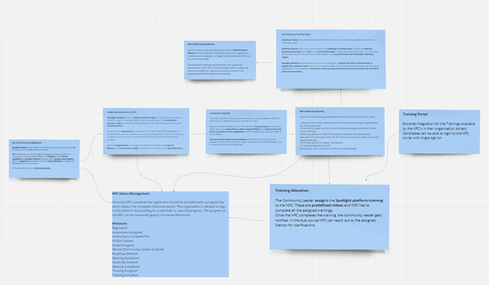
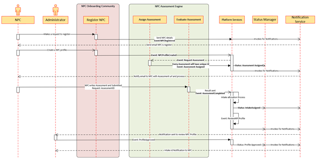

< [Home](../README.md) | [Previous](./8_Arch_CandidateRoadmapTracker.md) | [Next](./10_Arch_NPCRoadmapTracker.md) >

# Non Profit Community Registration

**Non Profit Community is the primary actor for the Spotlight Platform**.

- NPC will register for program offerings or services which can be utilized by the onboarded candidates.
- As part of the process discovery we have derived the below flow.
- The below representation shows the high levels steps which the NPC has to undergo during the registration process. 
- Every milestone of the NPC Registration process has been captured in the Status Management.
- The registration process is initiated by the NPC logging into the Spotlight platform (Web/Mobile).
- This is the initial step for the NPC, it starts with registration and ends with NPC assignment request.
- Based on the NPC’s Program offering preferences on the user interface gets changed. This is a dynamic user interface.
- NPC gets notified with email to complete the profile after the mail id/mobile gets validated.
- Once the profile is created, administrator will approve and the Intake ID is assigned.

## Prerequisites:
- NA

## Process Discovery:

  

## Output:
- Assessment Complete and Intake Assigned.

#### Subdomain and Bounded Context:

Below are the Core, Generic and Supporting Subdomains which get involved for the NPC registration process.

- **Core Subdomain:** NPC Onboarding Community
- **Supporting Subdomain:** NPC Assessment Engine
- **Generic Subdomains:** Platform Services, Status Manager, Notification Services

## Non Profit Community Registration Sequence Diagram

  

#### Key Patterns and ADRs identified for the Candidate Registration process

- [Micro Frontend](../ADRs/ADR014_MicroFrontend.md)
- [BFF](../ADRs/ADR012_BFF.md)
- [CQRS](../ADRs/ADR013_CQRS.md)

< [Home](../README.md) | [Previous](./8_Arch_CandidateRoadmapTracker.md) | [Next](./10_Arch_NPCRoadmapTracker.md) >
