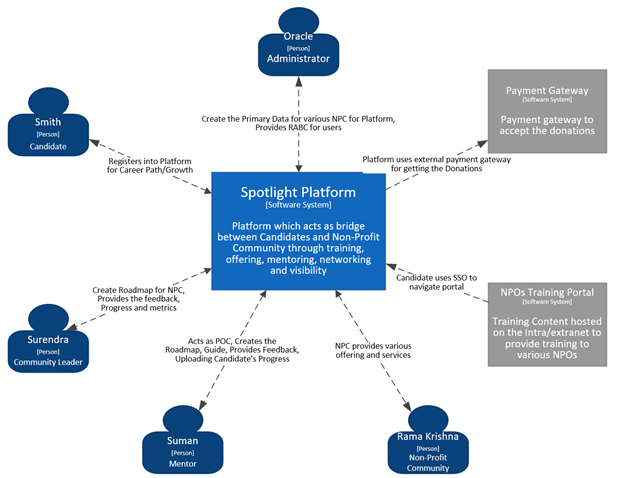
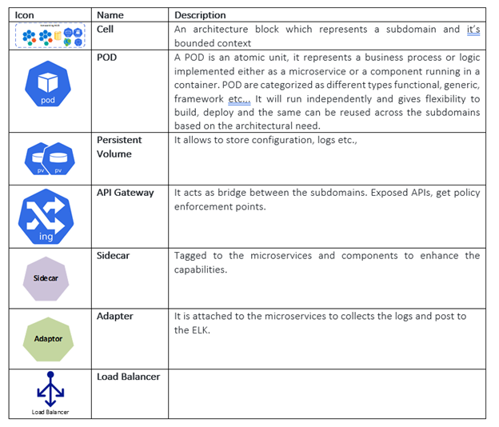
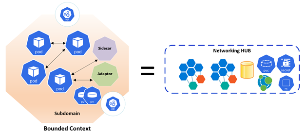
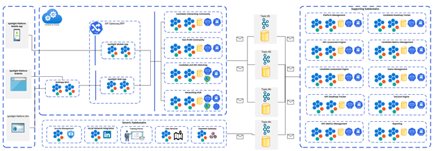
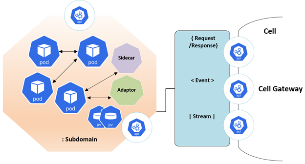
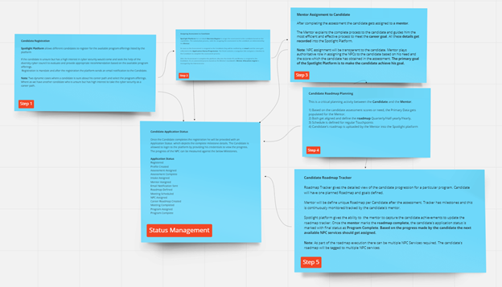
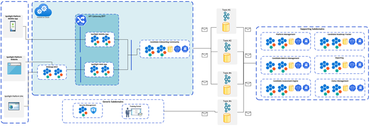
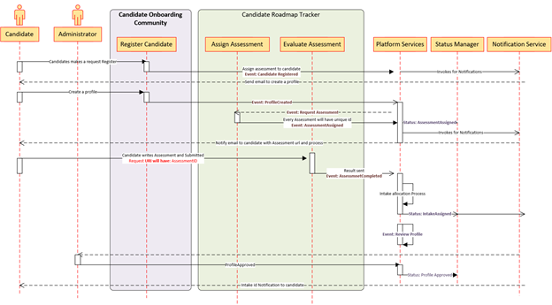

# Architecture Overview
## Table of Content
- Overview 
- Spotlight Context Diagram 
- Architecture Component Diagram
- Spotlight Platform Component Diagram 
- Domain Context Map to Microservices Mapping
- Candidate Registration 
- Candidate Onboarding Process 
- Candidate Roadmap Tracker 
- Non Profit Community Registration 
- Non Profit Community Networking HUB 
- NPC Activity Tracker on NPC Network HUB
- NPC Recommendation Engine
- Fabric Causal Cluster and No single point of failure

### Overview 
To solve the primary business problem our approach was to identify a domain model that reflects the Spotlight platform vision. We have used DDD and Bounded Context patterns. Each bounded context will have fleet of microservice and will have the flexibility of employing different patterns and they will have different responsibilities to solve the Domain problem. 
Proposal is to use Cell Based Architecture which gives Spotlight platform to be build as a decentralized cloud native application. Each Cell represents a Subdomain’s bounded context which can be independently deployable, manageable, and observable. It implies the Core Subdomains below can have their independent journey. 
- Candidate Onboarding Community
-	Non Profit Community 
- Candidate and NPC Matching
- Networking HUB

### Spotlight Context Diagram 

- The Architectural characteristics that are identified are as below:
- Scalability, the ability to deal with changing workloads by utilizing available resources and effectively maintaining a service level. Modern cloud infrastructure allows components, such as containers, to be scaled effectively, provided they are designed in the correct manner-	

- Modularity, is the idea that components of the architecture are versioned, replicable, and have well-defined interfaces. It is about exposing the right interfaces into a versioned system as well as hiding the details of the internal workings. Business mirroring with domain-driven design (DDD) is the foundation for defining modularity at the macro level.
- Composability, is about creating a recursive and uniform architecture where new components and capabilities add to the overall platform in a seamless way. For example, adding business logic in a web page makes it hard for other systems to build on top of that logic, whereas adding the same logic to an API allows web applications, mobile apps, and other server-based systems to access that logic.
- Governance, is about building managed, monitored, resilient systems and ensuring that organizational policies are enforced.
- Extendibility
-	Agility, 
-	Testability,
-	Deployability 
-	Configurability 
-	Workflow 
-	Security

### Architecture Component Diagram
The Architecture proposal is to use Microservices Oriented style with multiple autonomous microservices each owning it’s data with in a Subdomain and implementing different patterns within each microservice with simple CRUD, CQRS patterns using HTTP as a communication protocol between the client apps and the microservices. 

- Note: Cell representation should be octagonal but for diagrammatic representation we have changed as below in out Component Diagram.

###  Spotlight Platform Component Diagram 
 
Cell is a representation of a Subdomain and divides the area of the business between the Candidate and Non-Profit Organization. Each cell has a bounded context and solves the problem statement with the help of it’s coarse grained microservices which are of the cell. Each cell is expected to solve a specific subdomain problem. 

Each cell will be a collection of microservices and components which are grouped and identified as part of the process discovery and later designed, implemented and deployed. Cell is an independently managed entity which can have its own observability, deployment, pipeline and version. This encapsulation ensures each subdomain migrate, deploy without impacting users and subdomains. The components, microservices with in the cell can communicate with each other using REST APIs and any intra cell communication will be either synchronous or asynchronous.

- Asynchronous: All these communication for data update propagation across the cell is based on Domain Events and proposal is to use Streaming platform Kafka.
- Synchronous: All these communication with be Restful services using an API gateway.
 

-	Request Response: API types provide an abstraction over everything that can be queried or activated based on the subdomain process needs.
-	Domain Events allow action in real-time based on changes that occur during the business process and allowing subdomain to react on the fact.
-	Streams capture the ongoing evolving nature of the environment, allowing pattern matching and analysis. It is primarily used in Networking HUB Core subdomain to capture the Non Profit community activities on the HUB.

Every Cell will have a document to depict all its offerings to other subdomains. All the capabilities which are expected to give value to it’s external subdomains will be exposed as network accessible endpoints. These endpoints will have APIs hosted. 

The capabilities of a cell must be network accessible endpoints. In addition, if the cell needs access to external dependencies, then these must also be exposed as network endpoints through a cell-gateway. These endpoints can expose APIs, events, or streams. Any interfaces that the microservices or serverless components offer that are not made available by the control point should be inaccessible from outside the cell. 

Security is Implicit Architectural Characteristic. As each cell is mapped to a subdomain with it’s boundary so it gives flexibility to have it’s own unique security requirements. Each cell will have it’s own security rules, policies and approaches. Proposal is to use to Identity Provider as Security Management is a Generic Subdomain stationed outside the Subdomains. 

For all the microservices and components we will be adopting container model.  Each container image instance represents a single process. Each container image works as a boundary for a process, it will have primitives that can be used to scale or batch the process. When the process completes, the container lifecycle ends. Containers will also represent long-running processes like web servers and also be short-lived processes like batch jobs, implemented using Kubernetes Corn jobs. If the process fails, the container ends, and the orchestrator takes over. The orchestrator will have how many instances should be running and if one fails, the orchestrator will create another container instance to replace the failed process.

###  Domain Context Map to Microservices Mapping
This section gives the mapping for the subdomains, process specific component view and the sequence diagram for the below business processes.

-	Candidate Registration
-	Candidate Onboarding onto Spotlight platform
-	Tagging Non Profit Community to Candidate ( to do)
-	Non Profit Community Registration
-	Non Profit Onboarding onto Spotlight platform
-	Non Profit Networking HUB

####  Candidate Registration
Candidate is the primary actor for the Spotlight Platform to avail the program offerings provided by the Non Profit Communities. As part of the process discovery we have derived the below flow.
The below representation shows the high levels steps which the candidate has to undergo using the registration process. 
Every milestone of the Candidate Registration process has been captured in the Status Management tile.
-	The registration process is initiated by the candidate logging into the Spotlight platform, he can do that using the web or a mobile platform.
-	This is the initial step for the candidate, it starts with registration and ends with NPC assignment request.
-	Based on the Candidate’s Program offering preferences the user interface gets changed
-	Candidate get notified with email to complete the profile after the mail id/mobile gets validated.
-	Once the profile is created, administrator will approve and Candidate Intake ID is assigned.

 

Output
-	Assessment Complete and Intake Assigned.
 
Subdomain and Bounded Context 
Below are the Core, Generic and Supporting Subdomains which get involved for the candidate registration process.
-	Core Subdomain: Candidate Onboarding Community
-	Supporting Subdomain: Candidate Roadmap Tracker 
-	Generic Subdomains: Platform Services, Status Manager, Notification Services
  
 - Candidate Registration Context view and bounded context
    
 - Candidate Registration Sequence Diagram
     
  
Primary actors involved in the Candidate Registration process are Candidate and Administration. It is a Single Page Application for Web Application and can be extended to the mobile platform also. It can be developed using React or Angular.
The above image depicts overall communication style used for the candidate registration. It shows all the subdomains, bounded context, microservices, events, API communication, notification services.
- ADRs
Key Patterns and ADRs identified for the Candidate Registration process
-	BFF
-	CQRS

####  Candidate Onboarding Process 
####  Candidate Roadmap Tracker 
####  Non Profit Community Registration 
#### - Non Profit Community Networking HUB 
####  NPC Activity Tracker on NPC Network HUB
####  NPC Recommendation Engine
####  Fabric Causal Cluster and No single point of failure

