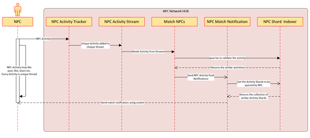

# Architecture Overview
## Table of Content
- Overview 
- Spotlight Context Diagram 
- Architecture Component Diagram
- Spotlight Platform Component Diagram 
- Domain Context Map to Microservices Mapping
- Candidate Registration 
- Candidate Onboarding Process 
- Candidate Roadmap Tracker 
- Non Profit Community Registration 
- NPC Roadmap Tracker
- Non Profit Community Networking HUB 
- NPC Activity Tracker on NPC Network HUB
- NPC Recommendation Engine
- Fabric Causal Cluster and No single point of failure 
### Overview 
To solve the primary business problem our approach was to identify a **domain model that reflects the **Spotlight platform vision**. 

We have used **DDD and Bounded Context patterns. Each bounded context will have fleet of microservice and will have the flexibility of employing different patterns and they will have different responsibilities to solve the Domain problem.**
Proposal is to use **Cell Based Architecture** which gives Spotlight platform to be build as a decentralized cloud native application. **Each Cell represents a Subdomain’s bounded context which can be independently deployable, manageable, and observable.**

It implies that the Core Subdomains below can have their independent journey. 

- Candidate Onboarding Community
- Non Profit Community 
- Candidate and NPC Matching
- Networking HUB

### Spotlight Context Diagram 

#### The Architectural characteristics that are identified are as below:

- Scalability
- Modularity     
- Composability
- Governance 
- Extendibility 
- Agility 
- Testability  
- Deployability 
- Workflow
- Security

### Architecture Component Diagram
The Architecture proposal is to use **Microservices Oriented style** with multiple autonomous microservices each owning it’s data with in a **Subdomain and implementing different patterns within each microservice with simple CRUD, CQRS patterns using HTTP as a communication protocol between the client apps and the microservices.** 

**Note: Cell representation should be octagonal but for diagrammatic representation we have changed as below in out Component Diagram.**

###  Spotlight Platform Component Diagram 

**Cell is a representation of a Subdomain and divides the area of the business between the Candidate and Non-Profit Community**. 

Each cell has a bounded context and solves the problem statement with the help of it’s coarse grained microservices which are of the cell. Each cell is expected to solve a specific **subdomain problem. **

- Each cell will be a collection of microservices and components which are grouped and identified as part of the process discovery and later designed, implemented and deployed. 
- Cell is an independently managed entity which can have its own observability, deployment, pipeline and version. This encapsulation ensures each subdomain to migrate, deploy without impacting users and subdomains. 
- The components, microservices with in the cell can communicate with each other using REST APIs. All the intra cell communication will be either synchronous or asynchronous.

  - **Asynchronous:** All these communication for data update propagation across the cell is based on Domain Events and proposal is to use Streaming platform Kafka.
  - **Synchronous:** All these communication with be Restful services using an API gateway.
  
 

  - **Request Response:** API types provide an abstraction over everything that can be queried or activated based on the subdomain process needs.
  - **Domain Events** allow action in real-time based on changes that occur during the business process and allowing subdomain to react on the fact.
  - **Streams** capture the ongoing evolving nature of the environment, allowing pattern matching and analysis. It is primarily used in Networking HUB Core subdomain    to capture the Non Profit community activities on the HUB.

- Every Cell will have a document to depict all its offerings to other subdomains.
- All the capabilities which are expected to give value to it’s **external subdomains** will be exposed as network accessible endpoints. These endpoints will have APIs hosted. 
- The capabilities of a cell must be network accessible endpoints. 
- In addition, if the cell needs access to external dependencies, then these must also be exposed as network endpoints through a cell-gateway. These endpoints can expose APIs, events, or streams. Any interfaces that the microservices or serverless components offer that are not made available by the control point should be inaccessible from outside of the cell. 

- **Security is Implicit Architectural Characteristic**. 
     - As each cell is mapped to a subdomain with it’s boundary so it gives flexibility to have it’s own unique security requirements. 
     - Each cell will have it’s own security rules, policies and approaches.
     - Proposal is to use to Identity Provider as Security Management is a Generic Subdomain stationed outside the Subdomains. 

- For all the microservices and components we will be adopting **container model.** 
- Each container image instance represents a single process. 
- Each container image works as a boundary for a process, it will have primitives that can be used to scale or batch the process. **When the process completes, the container lifecycle ends.** 
- Containers will also represent long-running processes like web servers and also be short-lived processes like batch jobs, implemented using Kubernetes Corn jobs. 
- If the process fails, the container ends, and the orchestrator takes over. The orchestrator will have how many instances should be running and if one fails, the orchestrator will create another container instance to replace the failed process.

###  Domain Context Map to Microservices Mapping

This section gives the **mapping for the Subdomains, Process specific component view and the Sequence diagram for the below business processes.**

- **Candidate Registration**
- **Candidate Onboarding onto Spotlight platform**
- **Non Profit Community Registration**
- **Non Profit Onboarding onto Spotlight platform**
- **Non Profit Networking HUB**

###  Candidate Registration

#### Process Discovery:
**Candidate is the primary actor for the Spotlight Platform** to avail the program offerings provided by the Non Profit Communities. As part of the process discovery we have derived the below flow.

The below representation shows the high levels steps which the candidate has to undergo using the registration process. 

- **Every milestone of the Candidate Registration process has been captured in the Status Management tile provided by the Status Managment Subdomain.**
- The registration process is initiated by the candidate logging into the Spotlight platform, he can do that using the web or a mobile platform.
- This is the initial step for the candidate, it starts with registration and ends with NPC assignment request.
- **Based on the Candidate’s Program offering preferences the user interface gets changed dynamically**
- Candidate get notified with email to complete the profile after the mail id/mobile gets validated.
- Once the profile is created, administrator will approve and Candidate Intake ID is assigned.

 

#### **Output**:

- Registration Complete and Intake Assigned.
 
#### Subdomain and Bounded Context:

Below are the Core, Generic and Supporting Subdomains which get involved for the candidate registration process.

- **Core Subdomain:** Candidate Onboarding Community
- **Supporting Subdomain:** Candidate Roadmap Tracker 
- **Generic Subdomains:** Platform Services, Status Manager, Notification Services  

 **Candidate Registration Context view and bounded context**
 

**Candidate Registration Sequence Diagram**

  
Primary actors involved in the **Candidate Registration process are Candidate and Administration.** 

- It is a Single Page Application for Web Application and can be extended to the mobile platform also. 
- It can be developed using React or Angular.
- The above image depicts overall communication style used for the candidate registration. It shows all the subdomains, bounded context, microservices, events, API communication, notification services.

#### ADRs:
Key Patterns and ADRs identified for the Candidate Registration process
- BFF
- CQRS

###  Candidate Onboarding Process:

- **Candidate and Mentor both are primary actors for the candidate onboarding process.
- Candidate has an intake and waiting for the Mentor to onboard him/her onto the platform.
- As part of the registration the candidate has just raised the request for Non Profit Community offerings and got the Intake ID assigned.
- Once the candidate gets onboarded completely, mentor will assign him the NPC based on the assessment results.
- The below representation shows the high level steps which both the candidate and mentor have to undergo in order to complete the onboarding process. 
- **Every milestone of the Candidate Onboarding process has been captured in the Status Management tile.**

#### Prerequisite: Candidate Intake ID Assigned.

#### High level steps and Process discovery

- The onboarding process gets initiated once the candidate completes the registration process.
   
 

#### Output:
- Mentor Assigned.
- Candidate and Mentor Meeting complete
- Roadmap Created
- Non Profit Community Assigned and Program assigned.

#### Subdomain and Bounded Context:

Below are the **Core, Generic and Supporting Subdomains*** which get involved for the candidate onboarding process.

- **Core Subdomain:** Candidate NPC Matching
- **Supporting Subdomain:** Candidate Roadmap Tracker
- **Generic Subdomains:** Platform Services, Status Manager, Notification Services

#### Candidate Registration Context view and bounded context 

 
 

#### Candidate Registration Sequence Diagram

 
 
#### Key Patterns and ADRs identified for the Candidate Registration process
- BFF
- CQRS

###  Candidate Roadmap Tracker
This is a critical process in the platform. 
**The primary actor for this process will be Candidate and the Mentor.** All the critical milestones of the candidate which were aligned during the initial meetings will be updated by the mentor based on the regular assessments.

#### Below is the high level process discovery.

 

- **Candidate Roadmap Tracker** helps the mentor to capture the program assessment results
- Candidate Roadmap Tracker capture all the regular meeting and provides all the data to the metrics management
- Based on the progress made by the candidate the next available **NPC services should get assigned.**
- **Candidate Metrics Management** capture all the results and give the rating based on the benchmark defined by the Platform Management. Marks will be defined.

#### Prerequisites/Inputs:

- Candidate and NPC should have been onboarded
- Candidate Mentor Assigned
- Program Offering Assigned to the Candidate

#### Candidate Roadmap Tracking process:

 

#### Subdomain and Bounded Context: 

Below are the Core, Generic and Supporting Subdomains which get involved for the candidate onboarding process.

- **Core Subdomain:** NA
- **Supporting Subdomain:** Candidate Metrics Management, Candidate Roadmap Tracker
- **Generic Subdomains:** Platform Services, Status Manager, Notification Services

#### Key Patterns and ADRs identified for the Candidate Registration process:

- Graph DB
- BFF
- CQRS

###  Non Profit Community Registration

**Non Profit Community is the primary actor for the Spotlight Platform.** 

- They register for program offerings or services which they can provide to the onboarded candidates.
- As part of the process discovery we have derived the below flow.
- The below representation shows the high levels steps which the NPC has to undergo during the registration process. 
- Every milestone of the NPC Registration process has been captured in the Status Management tile.
- The registration process is initiated by the NPC logging into the Spotlight platform, he can do that using the web or a mobile platform.
- This is the initial step for the NPC, it starts with registration and ends with NPC assignment request.
- Based on the NPC’s Program offering preferences on the user interface gets changed. This is a dynamic user interface.
- NPC gets notified with email to complete the profile after the mail id/mobile gets validated.
- Once the profile is created, administrator will approve and the Intake ID is assigned.

#### Prerequisites/Input: NA

#### Non Profit Community Registration Process Discovery

 

#### Output:
- Assessment Complete and Intake Assigned.

#### Subdomain and Bounded Context:

Below are the Core, Generic and Supporting Subdomains which get involved for the NPC registration process.

- **Core Subdomain:** NPC Onboarding Community
- **Supporting Subdomain:** NPC Assessment Engine
- **Generic Subdomains:** Platform Services, Status Manager, Notification Services

#### Non Profit Community Registration Sequence Diagram

 

#### Key Patterns and ADRs identified for the Candidate Registration process

- Micro Frontend
- BFF
- CQRS

###  Non Profit Community Onboarding Process 

**NPC, Community Leader and Administrator are the primary actors for onboarding the NPC onto the Spotlight Process.**

- NPC has an intake and waiting for the Community Leader to onboard the NPC onto the platform.
- As part of the registration the NPC has just raised the request against the service offerings and got the Intake ID assigned. 
- Once the NPC gets onboarded completely, Community Leader will assign him the candidates based on the NPC Capacity, Bandwidth and roadmap which the NPC gets aligned during the initial meeting.
- The below representation shows the high level steps which both the NPC and Community have undergo to complete the onboarding process. 
- Every milestone of the NPC Onboarding process has been captured in the Status Management tile.

#### Prerequisites/Input

- NPC Intake ID Assigned.

#### Prerequisites/Input

#### Non Profit Community Onboarding Process Discovery

 

#### Output:

- NPC gets onboarded onto the Spotlight Platform
- Training will get assigned to the NPC and it is mandate for him to complete. 

#### Subdomain and Bounded Context:

Below are the Core, Generic and Supporting Subdomains which get involved for the NPC registration process.

- **Core Subdomain:** Candidate and NPC Matching
- **Supporting Subdomain:** NPC Roadmap Tracker
- **Generic Subdomains:** Platform Services, Status Manager, Notification Services

#### Non Profit Community Onboarding Sequence Diagram

 

#### Key Patterns and ADRs identified for the Candidate Registration process:

- Micro Frontend
- BFF
- CQRS

###  NPC Roadmap Tracker
This is a critical process in the platform. 

- **The primary actor for this process will be Community Leader, NPC and Administrator.** 
- All the critical milestones of the NPC which were aligned during the initial meetings will be updated by the NPC based on the regular assessments. 
- NPC Roadmap Tracker captures all the regular meeting and provides all the data to the NPC Metrics management
- NPC Metrics Management plays a critical and it has Decision Engine will validates assigns the NPC Stack ranking.
- Based on the progress made by the NPC the next available NPC services should get assigned. 

#### Output:

- Completion of Program Offering services per candidate
- Helps in NPC Capacity Planning 
- Administrator will be able to assess the bandwidth of the NPC

#### Subdomain and Bounded Context:

Below are the Core, Generic and Supporting Subdomains which get involved for the NPC registration process.

- **Core Subdomain:** NA
- **Supporting Subdomain:** NPC Roadmap Tracker, NPC Metrics Management
- **Generic Subdomains:** Platform Services, Status Manager, Notification Services

#### Non-Profit Community Roadmap Tracker Sequence Flow:

 

#### Key Patterns and ADRs identified for the Candidate Registration process:

- Graph DB
- BFF
- CQRS

###  Non Profit Community Networking HUB

The section covers all the functionalities and system architecture for the Network HUB. From the strategy perspective as Networking HUB is a core subdomain our approach towards architecture is different. 

Below is the process discovery which was done as part of the event storming sessions.

Non Profit Community Networking HUB Process Discovery
 

#### High Level In Scope
- NPC Profile will be created in the Network HUB once the NPC Roadmap Tracker sub domain posts an Event for Create Profile
- NPC user will be allowed to add additional data and upload photos.
- NPC should be able to like and should be able to tag to other NPCs
- NPC should get notifications when matched with other NPC
- NPC should be able to view recommendations of other NPC in geographically nearby regions.
- NPC can move to different location and still the NPC Networking HUB should still be able to get recommendations of nearby NPCs
- All the onboarded NPCs of the Spotlight platform will be the users of the Networking HUB. 
- Networking HUB will feed stream data which will help the Candidate NPC allocation
- Post Non Profit Services, Events, Create Channels etc.,
- Push Notifications to NPCs based on Matching, Likes, Interest, Post etc.,

#### Next Phase Scope
- Chatting Service on the HUB.
- Onboarded Candidate can have just the Read only View to gain knowledge of the NP Community activities happening based on the Geo-Location.
- Candidate can show up interest to participate and contribute in NP Community services but this needs Mentor approval.
- Support for multiple languages if the Spotlight platform expands the services globally.

#### Subdomain and Bounded Context:

Below are the Core, Generic and Supporting Subdomains which get involved for the NPC registration process.
- **Core Subdomain:** Networking HUB
- **Supporting Subdomain:** Profile Creation, NPC Activity Tracker, Recommendation Engine, NPC Match Notification, NPC Shard Indexer, Match NPCs, NPC Activity Streams
- **Generic Subdomains:** Platform Services, Status Manager, Notification Services

#### Non Profit Community Networking HUB Context view and Bounded Context

 

- There will be a stack of microservices behind the API gateway, which serve the Non Profit Community user requests. 
- As soon the NPC user logins to the Network site for the first time, it invokes NPC Profile API hosted by the “Non Profit Community Core subdomain” will be invoked to add to the corresponding sharded index so that the NPC shows up in recommendations of the nearby NPC members of the Spotlight platform. 
- NPC user requests “Recommendations” to the HUB Recommendation Engine, and the index gets queried to generate recommendations for the users. 
- Once the NPC user starts Liking through those recommendations, the HUB Like Service receives those Likes and places them in a data-streams. 
- This service should be elastic enough to handle the inflow and it pushes the data into Kafka Streams. 
- There will be a pool of activity based HUB Worker services which read data from these streams for generating NPC matches. 
- The HUB Worker queries on the Likes data and sends the match notification to both the NPC users using Web Sockets.

**Note: We have just given “Like”one such activity which a NPC does on the HUB.**

#### NPC Profile Creation: For the first time user. 

- NPC doesn’t need to register in the Network HUB
- NPC User login to the HUB it checks the profile, if it doesn’t exist the NPC Profile Creation service invokes the API, Get NPC Profile hosted by Non Profit Community Core Subdomain.
- Once the data is retrieved and the same gets persisted to the corresponding Sharded Index 
 
#### Login:
- OAuth or Single sign on will be used to validate the NPC profile. The profile service will be hosted by the Non Profit Community domain.
- Once the validation is complete NPC will be able to see other NPC profiles based on the NPC Network Recommendation Engine. This engine is part of NPC HUB Core domain. 
- NPC Activity Tracker: NPC Network HUB will act as matching engine so that the most NPCs meet. This is to establish meaningful relationships to provide service offerings to the candidates. The core objective is to track the activity of the NPC on the HUB.
- Pull Data: When a NPC does oAuth using FB, LinkedIn etc., it collects lots of meaningful information like location, distance, likes, dislikes. It also extracts lots of information from pictures from the Post to understand community activities, events, CSR etc., and these get appended to the NPC profile.
- NPC Ranker: It is a critical background component which assigns a random scores and based on these NPC will be grouped. It is achieved using shard/distribute, as we can’t keep all the data in one Graph DB. 
- NPC Service Offering Levelling technique: If one NPC is getting too much of matches/attention, to make it fair for NPCs, Networking normalizes this by not showing to other NPC but at the same time if any NPC is not showing attention the Recommendation Engine will start showing up to other NPC about it’s services.
- Reply/Tagging: How willingly the NPC is replying and getting tagged to other NPCs
- User can upload photos. There is a limit, it’s governed by the Spotlight platform Administrator. All the photos/videos are persisted in a Blob store and the path in the Graph DB.
- Neo4J is used as Graph DB.
- Service makes a request to fetch the recommendations from the HUB Recommendation Engine. This is a preliminary set and cached index.
- At the same time a domain event “Recommendations” is fired asynchronously to the engine for a refined recommendation.

#### NPC Profile Creation on the NPC Network HUB

 

#### NPC Activity Tracker:
- This service captures all the sequence of operations that gets executed by a user 
   - Post like
   - Tag
   - Posts
   - Accepts Notifications
   - Creating Channels
   - Voting Request for Community Service
    
- Each activity mentioned above will have Unique Microservices per Activity. Examples below
- TAG: NPC Tag Activity Service
- Posts: NPC POST Activity Service
- Each activity above has separate stream. As the new feature gets added to the activities section, we will have to introduce new streams.
- Each activity can be used for data analysis for different use cases.
- All these streams are ultimately read by the Unique Activity Tracker Service. For every Activity we will have separate microservices. This gives flexibility to plan, scale, analyze, cache the data based on the user activity on the network hub.
- For Instance NPC A, does only Likes the Posts. For this user more Posts and NPC offerings will be recommended.
- Another NPC B, does lot of Posts about their service offerings. For this user more Notifications and Tag requests are sent.
- All these activities are posted to the Sharded Graph DB.

#### NPC Activity Tracker on NPC Network HUB
 

#### NPC Collaboration Request: 
This is a unique activity which helps the NPCs to collaborate.
- NPC A sends collaboration Request to NPC B.
- Collaboration request is posted into the unique collaboration stream and same gets notified to NPC B
- If NPC B accepts the collaboration request both get tagged.

#### HUB Recommendation Engine: 
It is core service which sends notifications, recommendations, matching requests and customizes the user content on the page. It’s a background thread gets domain events all the services.
- Every Activity which the user does on the Network HUB it forwards the request to the Shard Indexer service.
- Shard Indexer service exposes an API
- Once the API is invoked it determines which shard to be queried based on the activity done by the user.
- Indexer queries all the sharded graphs to fetch the list based on the activity search and return the list to the Recommendation Engine. 
- Engine applies to filter on the list bases on the NPC Preferences and returns final list.
- Recommendation Engine also pulls data from NPC Roadmap Tracker subdomain.

#### NPC Recommendation Engine
 

#### Shard Indexer: This service provides the data from the Shard Graph DB. 

- This process will have two different set of services
- One pool of services which will keep helping the 
  - **NPC Match Notification Service:** For provide the match notifications
  - **Match NPCs:** For providing match recommendations.  
- For reads, the Indexer service implements queries independently
- For each reading activity we will have a separate instance and whereas for the transactional area we will have separate service. This implementation is primarily because the demands for the queries are drastically different. 
- This domain holds **Shard DB Architecture** which is very critical to handle the traffic. The proposed architecture is to divide data into horizontal partitions that are organized into various servers. Primary reasons to shard
- Data will be siloed into separate instances based on different NPC activities
  - By Region
  - Action  	
  - By Service Offerings
  - By Likes
  - Events
  - To minimize the latency
  
**Neo4J Fabric** is the solution for graph sharding which allows the NPCs to break the graphs based on the relationships. It allows to store smaller graphs and store them in separate databases. 

### Fabric Causal Cluster and No single point of failure
 

- Architecture proposed is separating the data stores into shards and placing them based on the activity into separate graph DBs. 
- This gives flexibility any combination of inhouse or cloud to fit the business needs and requirements. 
- The above architecture representation has 2 coordinated shards which will give us always high availability and We have separated the fabric database to solely handle all of the load and processing of requests.

#### Data Division
- As part of the analysis the context and the data definitions will be clearly defined and how the data has to be modeled so that we can have subgraphs.
- All the shards will be divided based on activity or on location. 
