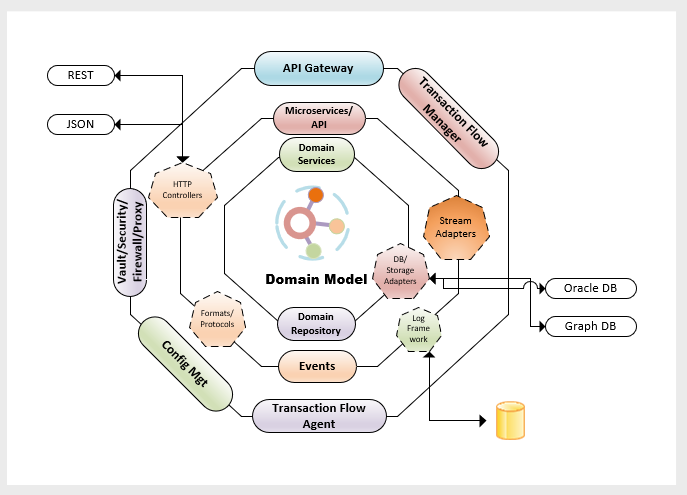

[<-- Back to Home](../README.md)

# Hexagon Architecture

The adoption of DDD has given us the flexibility of dividing the system into several loosely coupled components and allow us to build the layers. These layers bring organized way to implement the business logic. Every Hexagon is a subdomain by itself. Every subdomain implementation will adpot Hexagon Architecture.

## Application Layer:
The business processes that get triggered by the actors are in our core Application Layer. In the application layer we have class 0 services implies highly available services. 

This layer also contains the triggering of Domain Events, which represents the fact of a business process. These domain or integration events trigger logic that is a side effect of a business process, like sending emails, notifying a 3rd party API, sending a push notification, or even starting another business process that belongs to a different component of the subdomain.

## Domain Layer: 

This layer contains data and the logic to manipulate that data, that is specific to the subdomain itself and it’s independent of the business processes that trigger the logic, they are independent and completely unaware of the Application Layer.

## Domain Model: 

It holds the business objects it represents a subdomain. It is also aware of the Domain Events and it triggers new events based on the data changes which happen in the Domain.

It's a single domain object

[<-- Back to Home](../README.md)
